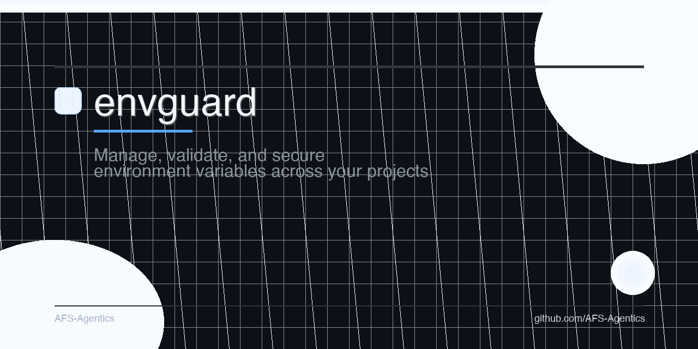

# EnvGuard 🔐

**Manage, validate, and secure environment variables across your projects.**

EnvGuard is a CLI tool that brings order to the chaos of `.env` files. It validates your environment variables against a schema, catches missing or malformed values before they reach production, encrypts sensitive files, and lets you switch between environment profiles (dev/staging/prod) with a single command.

```bash
# Quick start
envguard init           # Bootstrap a schema from your existing .env
envguard validate       # Check everything is in order
envguard doctor         # Full health audit of your env setup
```

---

## Why EnvGuard?

Every developer has been bitten by:
- A missing `DATABASE_URL` that takes 30 minutes to debug
- `.env.example` that's hopelessly out of date with the actual `.env`
- Accidentally committing secrets to git
- Sharing `.env` files over Slack (encrypted? never.)
- Juggling different env setups for dev, staging, and CI

EnvGuard solves all of this in one lightweight, dependency-minimal CLI.

---

## Installation

### Via pip

```bash
pip install envguard
```

### Via pipx (recommended — isolated install)

```bash
pipx install envguard
```

### From source

```bash
git clone https://github.com/AFS-Agentics/envguard.git
cd envguard
pip install .
```

### Requirements

- **Python 3.10+**
- **cryptography** library (installed automatically with pip)

---

## Usage

### 1. `envguard init` — Bootstrap a schema

Scans your project's `.env` files and generates a `.env.schema` file with inferred types.

```bash
cd my-project
envguard init
```

This creates `.env.schema`:

```
# EnvGuard .env.schema
# Format: KEY  type  required  "description"  # default: value

DATABASE_URL  str   true    "PostgreSQL connection string"
API_KEY       str   true    "API key for external service"
DEBUG         bool  false   "Enable debug mode (0/1, true/false, yes/no)"
PORT          int   false   "Server port (default: 8080)"
```

**Options:**

| Flag | Description |
|------|-------------|
| `--path`, `-p` | Project directory (default: auto-detect from cwd) |
| `--force`, `-f` | Overwrite existing `.env.schema` |
| `--merge`, `-m` | Merge new entries into existing `.env.schema` |

### 2. `envguard validate` — Validate against schema

Checks all `.env` files against the schema — type validation, required fields, extra variables.

```bash
envguard validate
```

Output:
```
  ✓  All 5 schema entries validated cleanly across .env.
```

Or, when there are issues:
```
  ❌ .env: missing required 'DATABASE_URL' (PostgreSQL connection string)
  ⚠  .env: optional 'DEBUG' not set (Enable debug mode)
  ❌ .env: 'PORT' is not a valid integer
  2 errors + 1 warning found.
```

**Options:**

| Flag | Description |
|------|-------------|
| `--path`, `-p` | Project directory |
| `--strict`, `-s` | Treat warnings as errors (non-zero exit) |
| `--silent` | Exit codes only, no output |

**Exit codes:**
- `0` — all good
- `1` — errors found (or warnings in strict mode)

### 3. `envguard generate` — Create .env.example

Generates a documented `.env.example` from your schema.

```bash
envguard generate
```

**Options:**

| Flag | Description |
|------|-------------|
| `--path`, `-p` | Project directory |
| `--force`, `-f` | Overwrite existing `.env.example` |
| `--fill` | Fill in default values from the schema |

### 4. `envguard encrypt` — Encrypt a .env file

Protect sensitive environment files with AES-256-GCM encryption + PBKDF2 key derivation.

```bash
envguard encrypt .env --password "your-secret-password"
# Creates .env.encrypted
```

**Options:**

| Flag | Description |
|------|-------------|
| `file` | Path to `.env` file (positional, required) |
| `--output`, `-o` | Output path (default: `<file>.encrypted`) |
| `--password` | Encryption password (uses `ENVGUARD_PASSWORD` env var, or prompts) |
| `--force`, `-f` | Overwrite existing output |

### 5. `envguard decrypt` — Decrypt a .env file

```bash
envguard decrypt .env.encrypted --password "your-secret-password" --output .env
```

**Options:**

| Flag | Description |
|------|-------------|
| `file` | Path to encrypted file (positional, required) |
| `--output`, `-o` | Output path (default: print to stdout) |
| `--password` | Decryption password |
| `--force`, `-f` | Overwrite existing output |

### 6. `envguard doctor` — Health audit

Runs a comprehensive check on your project's environment setup:

```bash
envguard doctor
```

Checks:
- ✅ `.env.schema` exists
- ✅ `.env.example` exists
- ✅ Env files present
- ✅ `.gitignore` covering `.env` files
- ✅ Schema validation passes
- ✅ Encrypted files tracked

### 7. `envguard profile` — Profile management

Save and switch between named environment configurations.

```bash
# Save current .env as a profile
envguard profile pin development

# List saved profiles
envguard profile list

# Show profile contents
envguard profile show development

# Switch to a profile (copies profile → .env)
envguard profile switch staging
```

**Sub-commands:**

| Command | Description |
|---------|-------------|
| `pin <name>` | Save current `.env` as a named profile |
| `list` | List all saved profiles |
| `show <name>` | Display profile contents (with secret masking) |
| `switch <name>` | Activate a profile (backups existing `.env`) |

---

## Configuration

EnvGuard is configured entirely through CLI flags and environment variables:

| Environment Variable | Purpose |
|---------------------|---------|
| `ENVGUARD_PASSWORD` | Default password for encrypt/decrypt (avoids prompt) |

### Schema File Format

`.env.schema` uses a simple, human-readable format:

```
# KEY            type    required    "description"                     # default: value
DATABASE_URL     str     true        "PostgreSQL connection string"
API_KEY          str     true        "API key for external service"
DEBUG            bool    false       "Enable debug mode"
PORT             int     false       "Server port"                     # default: 8080
MAX_RETRIES      int     false       "Max retry attempts"              # default: 3
LOG_LEVEL        str     false       "Logging level"
REDIS_URL        url     false       "Redis connection URL"
ADMIN_EMAIL      email   false       "Admin notification email"
FEATURE_FLAGS    json    false       "Feature flag configuration"
DATA_DIR         path    false       "Data directory path"
```

**Supported types:**

| Type | Description | Validation |
|------|-------------|------------|
| `str` | String | Any non-empty value |
| `int` | Integer | Must parse as integer |
| `float` | Float | Must parse as float |
| `bool` | Boolean | `1/0`, `true/false`, `yes/no`, `on/off` |
| `url` | URL | Must start with `http://`, `https://`, `ftp://`, etc. |
| `email` | Email | Basic email format check |
| `json` | JSON | Must parse as valid JSON |
| `path` | File path | Non-empty, no null bytes |

---

## Project Structure

```
envguard/
├── LICENSE
├── README.md
├── pyproject.toml           # Package metadata + dependencies
├── envguard/
│   ├── __init__.py          # Package init, version
│   ├── __main__.py          # python -m envguard support
│   ├── cli.py               # CLI entrypoint, argument parsing
│   ├── schema.py            # Schema parsing, validation, generation
│   ├── crypto.py            # AES-256-GCM encrypt/decrypt
│   └── profiles.py          # Profile management
└── tests/
    └── test_envguard.py     # 58 unit tests
```

---

## Security

- **Encryption**: AES-256-GCM (authenticated encryption — tampering is detected)
- **Key derivation**: PBKDF2-HMAC-SHA256 with 600,000 iterations and random salt
- **No plaintext leakage**: Encrypted files contain a magic header (`EGCM`) plus salt + nonce + ciphertext; no plaintext is ever written to disk
- **Profiles are plain files**: Profile `.env` files are stored in `.envguard/` — add this to your `.gitignore`

---

## Development

```bash
git clone https://github.com/AFS-Agentics/envguard.git
cd envguard
pip install -e ".[dev]"
pytest tests/ -v
```

---

## License

MIT License — see [LICENSE](LICENSE) for details.

Built by [AFS Agentics](https://github.com/AFS-Agentics).
